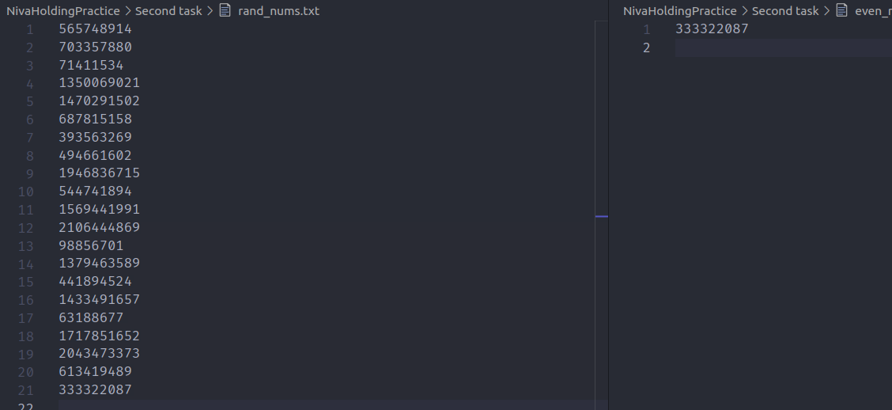

## Задание 1
Получить значение с АЦП микроконтроллера, чем выше значение приходящее с АЦП тем быстрее моргает светодиод. Раз в 1 секунду отправить это значение на сторону компьютера по UART, используя адаптер(если есть, если нет, то реализуем этот процесс только в коде). Исходя из показаний RTC каждую кратную пяти секунду записывать показатели АЦП во внутренний флэш микроконтроллера, новое значение записывается в следующий байт(байты) флэш памяти. После сохранения 10-ти значений данные во флэш очищаются и запись начинается заново с байта с которого начиналась.

### *Скрин-отчет*
*1. Изначальное положение элементов*

*2. Подсчет АЦП микроконтроллера с занесением значения во внутренний флеш каждую кратную пяти секунду*

*3. Очистка памяти после десятого записанного значения*

[Код задания 1](First%20task/ADCReadSolution/ADCRead/main.c)

## Задание 2
Сгенерировать случайное число. Раз в 1 секунду сохранять это значение в файл. Исходя из показаний Текущего времени каждую четную секунду записывать число во второй файл новое значение записывается в файл за предыдущим. После сохранения 10-ти значений данные из файла удаляются. И запись возобновляется.

### *Скрин-отчет*
1. Так выглядела бы схема, если бы вышло сделать ее в proteus

2. Запсь случайных чисел в файлы 

3. Одиннадцатое число перезаписывает второй файл

[Код задания 2](Second%20task/task.c)

[Код задания 2 (для мк)](Second%20task/SDWrite.ino)